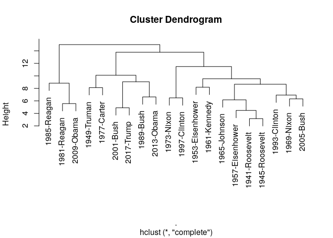
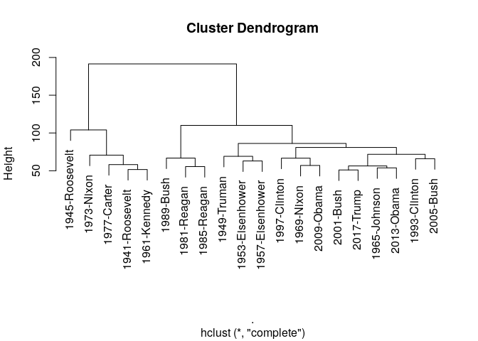

``` r
require(quanteda)
require(quanteda.features)
toks <- tokens(tail(data_corpus_inaugural, 20))
dict <- dictionary(file = "/home/kohei/Documents/Dictionary/Lexicoder/policy_agendas_english.lcd")
```

``` r
dfm_opinions(toks, dict, data_dictionary_LSD2015[1:2]) %>% 
    textstat_dist() %>% 
    as.dist() %>% 
    hclust() %>% 
    plot()
```

<!-- -->

``` r
dfm(toks, remove = stopwords()) %>% 
    textstat_dist() %>% 
    as.dist() %>% 
    hclust() %>% 
    plot()
```

<!-- -->
